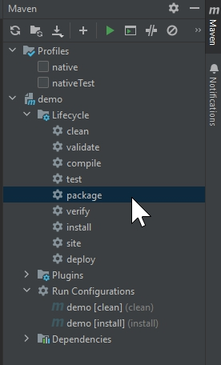

# STraffic 표준개발플랫폼 및 개발 표준 (작성 중)

React - Spring Web 개발 표준 플랫폼

## 1.  표준개발플랫폼 설치
### 1.1 형상관리: Git(로컬에 설치)

### 1.2 IDE
    1) JDK 19: OpenJDK 19
    2) IntelliJ Community Edition 설치
    3) Plug-in 설치: 'Settings' > 'Plugins'
      - Github 설치
      - ERD Editor 설치        
    4) Swagger(설치 불필요) : REST API 문서화

### 1.3 IDE와 Git 연동
    1) SSL 확인 false 설정: 윈도우 CMD에서 다음 명령어 실행
       'git config --global http.sslVerify false'
    2) Github의 프로젝트에서 "Clone with https"를 클릭하여 URL 복사
    3) 프로젝트 생성: "Get from VCS"를 클릭해서, Github에 있는 프로젝트를 생성
        - Repository URL에 복사해둔 저장소 URL을 입력

### 1.3 Database 및 Tool
    1) PostgreSQL
    2) DBeaver

### 1.4 Front-end 도구
    1) Node.js 설치

### 1.5 Swagger 설정
    1) Node.js 설치

## 2.  Web 개발표준(w1.0)
 
    Framework
        Front-end: React(Design MUI)
            Optional: Node.js, vue.js, vue cli 설치 후 >> IntelliJ 연동   
        Back-end: Spring Boot (jdk 19) 
            Lombok
            SLF4J(Simple Logging Facade for Java)

    DBMS: Postgresql    

## 2. 개발 환경 설정

1. Source 다운로드 : git clone https://172.20.30.20:20443/common/common-spring-react.git

2. java 17 버젼 이상 설치.

3. 환경 변수 등록

4. IntelliJ java compiler 확인.


5. IntelliJ Project SDK 확인.


6. NodeJS 설치

    [https://nodejs.org/en](https://nodejs.org/en)


7. React 패키지 설치.

>    $ cd {source root}/demo/src/main/wepapp
> 
>    $ npm install

8. Maven clean, install

    프로젝트 Maven 관련 패키지를 설치 합니다.


9. Run Configuration


10. DB 연결 설정


    파일 경로 : demo > src > main > resources > application.yml

```
spring:
  web:
    resources:
      static-locations: classpath:/static, classpath:/webapp
  datasource:
    # Postgresql setting
    url: jdbc:postgresql://192.168.56.1:35432/OPS
    username: OPS
    password: OPS123
    hikari:
      data-source-properties:
        useUnicode: true
        characterEncoding: UTF-8
```

## 3.  resources

#### application.yml
        Spring 기본 설정 파일입니다. application.properties 파일과 동일한 역할을 합니다.  

#### import.sql
        서버 시작 시 실행 할 SQL입니다. 주로 기초 데이터를 생성합니다.
        'ddl-auto' 옵션에 따라 실행 여부가 결정됩니다.

#### logback.xml
        Slf4j 로거에 대한 설정입니다. 
        사용법은 java 소스 내에 log.debug("메시지") 으로 사용가능합니다.
        log level은 debug > info > warn > error > trace 가 있습니다.

## 배포

React 빌드와 Spring-boot 빌드를 진행해야 합니다.
    
    React : build/
    Spring-boot : .jar, .war

1. React build
    >.env.production 파일 내 변수값 확인.
    > 
    >$ npm run build
    
    > build/ 폴더 생성 확인. 
   
2. Spring-boot build
   > maven build
   >  
   

   > demo > target > {실행파일}.jar 생성 확인.
   
3. Deploy
   1. 서버로 파일 copy
      > [root@localhost react-spring]# ll
      ```
      total 64609 
      -rwxrwxrwx 1 root root     1650 Mar 13 18:34 application.yml 
      drwxrwxrwx 1 root root        0 Mar 13 01:52 build 
      -rw-rw-rw- 1 root root 65916697 Mar 12 22:58 demo-0.0.1-SNAPSHOT.jar
      ```
      운영서버에 맞는 application.yml 파일을 jar파일과 같은 경로에 생성.
      
         ```
          # 운영서버는 ddl를 매번 재실행시키지 않는 none옵션으로 적용.
          jpa:
            hibernate:
              # ddl-auto: create
              ddl-auto: none
         ``` 
   2. Nginx 설치
      
      nginx.conf 파일 확인
      
      port : 8080
      
      web root : /root/react-spring/build
      
      /api/** 로 호출되는 request는 모두 spring에서 처리하게 forwarding 해줍니다.
      
         ```
         server {
               listen       8080 default_server;
               listen       [::]:8080 default_server;
               server_name  _;
               root         /root/react-spring/build;
                    
               location / {
               }

               location /api {
                     proxy_pass http://192.168.56.1:82/api;
               }
         }
         ```
   3. Java 설치
   4. run.sh 만들기
   5. 실행 확인


## 업데이트 내역
    2024/03/08 : 1. 샘플 프로젝트 불필요 파일 삭제.
                 2. spring security 기본 설정 추가(기본 disable로 처리)

    2024/03/13 : 1. 개발환경 설정 추가.
    2024/03/14 : 1. 배포 챕터 추가.