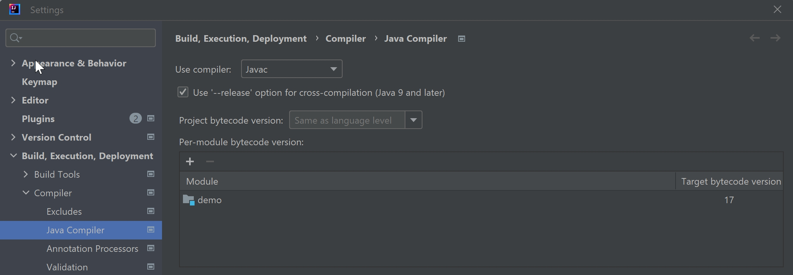
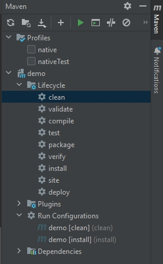
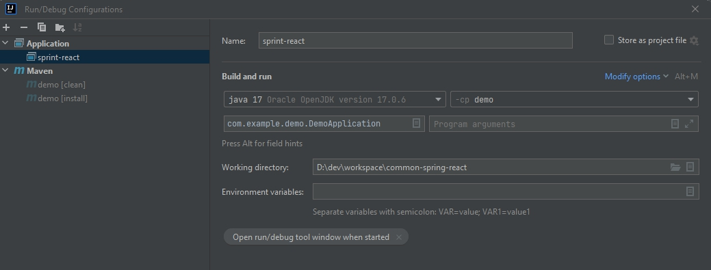

# STraffic 표준개발플랫폼 및 개발 표준 (작성 중)

React - Spring Web 개발 표준 플랫폼

## 1.  표준개발플랫폼 설치
### 1.1 형상관리: Git(로컬에 설치)

### 1.2 IDE

1) Java 17버전 이상 설치: OpenJDK 등
   - OpenJDK 등
   - 환경변수 등록
2) IntelliJ 설치
   - IntelliJ java compiler 확인. 
      
   - IntelliJ Project SDK 확인.
      
   - Plug-in 설치: 'Settings' > 'Plugins'\
      Github 설치\
      Lombok 설치\
      ERD Editor 설치\
      Node.js: IntelliJ Ultimate버전에서만 가능
3) Swagger(설치 불필요) : REST API 문서화

### 1.3 IDE와 Git 연동
1) SSL 확인 false 설정: 윈도우 CMD에서 다음 명령어 실행
   - 'git config --global http.sslVerify false'
2) Github의 프로젝트에서 "Clone with https"를 클릭하여 URL 복사
3) 프로젝트 생성: "Get from VCS"를 클릭해서, Github에 있는 프로젝트를 생성
   - Repository URL에 복사해둔 저장소 URL을 입력

### 1.3 Database 및 query Tool
    1) PostgreSQL
        - 
        ※참고: Windows Home Edition에서는 docker설치가 안되므로, 직접 설치해야 함.
    2) DBeaver

### 1.4 Front-end: Node.js 설치 방법
1) Node.js란
   - 자바스크립트로 서버 애플리케이션을 구현할 수 있게 해주는 서버 플랫폼
   - Chrome V8 Javascript 엔진으로부터 빌드된 Javascript 런타임 

2) 공식사이트 [https://nodejs.org/en] (https://nodejs.org) 에서 다운받아, default로 설치 
   - 설치 확인: cmd를 열어서 "node -v"를 입력하여 설치 버전 확인

3) Node.js 설치 방법2: 윈도우의 파워쉘에서 Chocolatey의 명령어 복사/실행
   - 참고: Chocolatey, 윈도우용 패키지설치관리자
   
4) NPM (Node Package Manager)
   - 자바스크립트 패키지 사이트에서 필요한 패키지를 내려받아 설치할 수 있는 프로그램.
   - "npm install 패키지이름"
   
5) 관련 패키지 설치
   - axios: Axios는 리액트와 서버의 통신이 가능하게 해주는 브라우저, 
                    Node.js를 위한 Promise API를 활용하는 HTTP 비동기 통신 라이브러리. 
                    "npm install axios"
6) 설치 후, 확인 방법
   - 하단 탭의 "Terminal"에서 설치한 버전 확인: "node -V", "vue -V"

7) "webapp > package.json" 설정
   - Back-end 서버의 IP와 port 등록

### 1.5 설치 확인
    1) Back-end 실행
        - DemoApplication을 Run
        - 브라우저에서 REST Api 명세를 확인 (port는 각자 설정대로)
            http://localhost:82/swagger-ui/index.html
    2) Front-end 실행
        - IntelliJ의 하단 Terminal에서 JS 엔진 start
        - 브라우저에서 화면이 뜬다: http://localhost:3000/list-info


## 2.  Web 개발표준(w1.0)

### 2.1 Framework 적용
    1) Back-end: Spring Boot (jdk 19) 
            Lombok
            SLF4J(Simple Logging Facade for Java)

        Front-end: React(Design MUI)
            Optional: Node.js, vue.js, vue cli 설치 후 >> IntelliJ 연동   

    DBMS: Postgresql    

## 2. 개발 환경 설정

1. Source 다운로드 : git clone https://172.20.30.20:20443/common/common-spring-react.git


7. React 패키지 설치.

>    $ cd {source root}/demo/src/main/wepapp
> 
>    $ npm install

8. Maven clean, install

    프로젝트 Maven 관련 패키지를 설치 합니다.



9. Run Configuration



10. DB 연결 설정


    파일 경로 : demo > src > main > resources > application.yml

```
spring:
  web:
    resources:
      static-locations: classpath:/static, classpath:/webapp
  datasource:
    # Postgresql setting
    url: jdbc:postgresql://192.168.56.1:35432/OPS
    username: OPS
    password: OPS123
    hikari:
      data-source-properties:
        useUnicode: true
        characterEncoding: UTF-8
```

## 3.  resources

#### application.yml
        Spring 기본 설정 파일입니다. application.properties 파일과 동일한 역할을 합니다.  

#### import.sql
        서버 시작 시 실행 할 SQL입니다. 주로 기초 데이터를 생성합니다.
        'ddl-auto' 옵션에 따라 실행 여부가 결정됩니다.

#### logback.xml
        Slf4j 로거에 대한 설정입니다. 
        사용법은 java 소스 내에 log.debug("메시지") 으로 사용가능합니다.
        log level은 debug > info > warn > error > trace 가 있습니다.

## 업데이트 내역
    2024/03/08 : 1. 샘플 프로젝트 불필요 파일 삭제.
                 2. spring security 기본 설정 추가(기본 disable로 처리)

    2024/03/13 : 1. 개발환경 설정 추가.