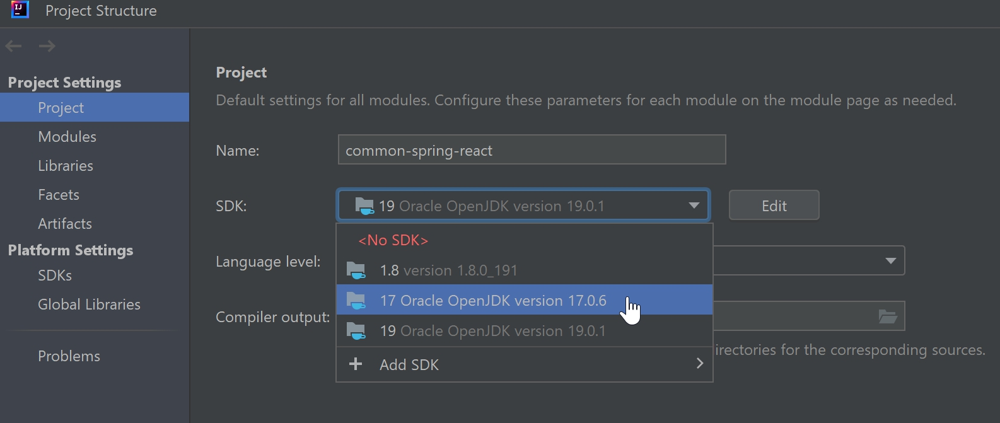

# STraffic 표준개발플랫폼 및 개발 표준 (작성 중)

React - Spring Web 개발 표준 플랫폼

## 1.  표준개발플랫폼 설치
### 1.1 형상관리: Git


<br/><br/>

### 1.2 IDE
1) Java 17버전 이상 설치: OpenJDK 등
   - OpenJDK 등
   - 환경변수 등록
2) IntelliJ 설치
   - IntelliJ java compiler 확인. 
      
   - IntelliJ Project SDK 확인.
      
   - Plug-in 설치: 'Settings' > 'Plugins'\
      Github 설치\
      Lombok 설치\
      ERD Editor 설치\
      Node.js: IntelliJ Ultimate버전에서만 가능
3) Swagger(설치 불필요) : REST API 문서화
4) Maven clean, install
   - 프로젝트 Maven 관련 패키지를 설치 합니다.\
      
5) Run(실행 환경) Configuration
   - application 빌드, 실행을 위한 디렉토리 설정
   

<br/><br/>

### 1.3 IDE와 Git 연동
1) SSL 확인 false 설정: 윈도우 CMD에서 다음 명령어 실행
   > git config --global http.sslVerify false
2) Github의 프로젝트에서 "Clone with https"를 클릭하여 URL 복사
   - CLI로 소스를 clone할 수도 있으나, 가급적 IntelliJ에서 연동하여 사용
   > git clone https://172.20.30.20:20443/common/common-spring-react.git
3) 프로젝트 생성: "Get from VCS"를 클릭해서, Github에 있는 프로젝트를 생성
   - Repository URL에 복사해둔 저장소 URL을 입력

<br/><br/>

### 1.4 Database 및 query Tool
1) PostgreSQL
   - 참고: Windows Home Edition에서는 docker설치가 안되므로, 직접 설치해야 함.
2) IDE에서 DB 연결 설정
   - 파일 경로 : demo > src > main > resources > application.yml
   ```
   spring:
     web:
       resources:
         static-locations: classpath:/static, classpath:/webapp
     datasource:
       # Postgresql setting
       url: jdbc:postgresql://192.168.56.1:35432/OPS
       username: OPS
       password: OPS123
       hikari:
         data-source-properties:
           useUnicode: true
           characterEncoding: UTF-8
    
3) DBeaver
4) Spring Database 초기화 방식
   - JPA 방식: @Entity가 붙은 클래스들을 스캔해서 자동으로 스키마 생성
   - SQL script 방식: schema.sql, data.sql을 통해 초기화 가능. 이 파일을 classpath의 루트 경로에 두면 datasource가 생성될 때 자동으로 읽고 초기화

<br/><br/>

### 1.5 Front-end: Node.js 설치 방법
1) Node.js란
   - 자바스크립트로 서버 애플리케이션을 구현할 수 있게 해주는 서버 플랫폼
   - Chrome V8 Javascript 엔진으로부터 빌드된 Javascript 런타임 
2) 공식사이트 [https://nodejs.org/en] (https://nodejs.org) 에서 다운받아, default로 설치 
   - 설치 확인: cmd를 열어서 
   > node -v
3) Node.js 설치 방법2: 윈도우의 파워쉘에서 Chocolatey의 명령어 복사/실행
   - 참고: Chocolatey, 윈도우용 패키지설치관리자
4) NPM (Node Package Manager)
   - 자바스크립트 패키지 사이트에서 필요한 패키지를 내려받아 설치할 수 있는 프로그램.
   > npm install 패키지이름
5) 관련 패키지 설치
   - axios: Axios는 리액트와 서버의 통신이 가능하게 해주는 브라우저, 
   - Node.js를 위한 Promise API를 활용하는 HTTP 비동기 통신 라이브러리.
   >  $ npm install axios
6) 설치 후, 확인 방법
   - 하단 탭의 "Terminal"에서 설치한 버전 확인
   > node -V
   > 
   > vue -V
7) "webapp > package.json" 설정
   - Back-end 서버의 IP와 port 등록

<br/><br/>

### 1.6 Front-end: React 패키지 설치.
1) webapp 폴더(package.json이 있는)에서 설치 __[확인 필요]__
   >  $ cd {source root}/demo/src/main/webapp
   >
   >  $ npm install
   
<br/><br/>

### 1.7 설치 확인
1) Back-end 실행
   - DemoApplication을 Run
   - 브라우저에서 REST Api 명세를 확인 (port는 각자 설정대로)
   - http://localhost:82/swagger-ui/index.html
2) Front-end 실행
   - IntelliJ의 하단 Terminal에서 JS 엔진 start
   - 브라우저에서 화면이 뜬다: http://localhost:3000/list-info


<br/><br/><br/><br/>


## 2.  Web 개발표준(w1.0)

### 2.1 Framework 적용
1) Back-end: Spring Boot (jdk 19) 
       Lombok
            SLF4J(Simple Logging Facade for Java)

2) Front-end: React(Design MUI)
      Optional: Node.js, vue.js, vue cli 설치 후 >> IntelliJ 연동   

3) DBMS: Postgresql


<br/><br/><br/><br/>


## 3.  resources

#### application.yml
1) Spring 기본 설정 파일입니다. application.properties 파일과 동일한 역할을 합니다.  
      >
      > spring:
      >    datasource:
      >       driver-class-name: org.h2.Driver
      >       url: jdbc:h2:mem:db
      >       username: sa
      >       password:
      >
      >   jpa:
      >       hibernate:
      >          ddl-auto: none
      >       properties:
      >          hibernate:
      >             format_sql: true
      >             show_sql: true

   
<br/><br/>

#### import.sql
1) 서버 시작 시 실행 할 SQL입니다. 주로 기초 데이터를 생성합니다.
   - 'ddl-auto' 옵션에 따라 실행 여부가 결정됩니다.

#### logback.xml
1) Slf4j 로거에 대한 설정입니다. 
   - 사용법은 java 소스 내에 log.debug("메시지") 으로 사용가능합니다.
   - log level은 debug > info > warn > error > trace 가 있습니다.

## 배포

React 빌드와 Spring-boot 빌드를 진행해야 합니다.
    
    React : build/
    Spring-boot : .jar, .war

1. React build
    >.env.production 파일 내 변수값 확인.
    > 
    >$ npm run build
    
    > build/ 폴더 생성 확인. 
   
2. Spring-boot build
   > maven build
   >  
   

   > demo > target > {실행파일}.jar 생성 확인.
   
3. Deploy
   1. 서버로 파일 copy
      > [root@localhost react-spring]# ll
      ```
      total 64609 
      -rwxrwxrwx 1 root root     1650 Mar 13 18:34 application.yml 
      drwxrwxrwx 1 root root        0 Mar 13 01:52 build 
      -rw-rw-rw- 1 root root 65916697 Mar 12 22:58 demo-0.0.1-SNAPSHOT.jar
      ```
      운영서버에 맞는 application.yml 파일을 jar파일과 같은 경로에 생성.
      
         ```
          # 운영서버는 ddl를 매번 재실행시키지 않는 none옵션으로 적용.
          jpa:
            hibernate:
              # ddl-auto: create
              ddl-auto: none
         ``` 
   2. Nginx 설치
      
      nginx.conf 파일 확인
      
      port : 8080
      
      web root : /root/react-spring/build
      
      /api/** 로 호출되는 request는 모두 spring에서 처리하게 forwarding 해줍니다.
      
         ```
         server {
               listen       8080 default_server;
               listen       [::]:8080 default_server;
               server_name  _;
               root         /root/react-spring/build;
                    
               location / {
               }

               location /api {
                     proxy_pass http://192.168.56.1:82/api;
               }
         }
         ```
   3. Java 설치
   4. run.sh 만들기
   5. 실행 확인


## 업데이트 내역
    2024/03/08 : 1. 샘플 프로젝트 불필요 파일 삭제.
                 2. spring security 기본 설정 추가(기본 disable로 처리)

    2024/03/13 : 1. 개발환경 설정 추가.
    2024/03/14 : 1. 배포 챕터 추가.
    2024/03/22 : 1. JWT 방식 로그인 시큐리티 추가.
                 2. 리퀘스트 JWT 인증 추가.
                 3. list form 샘플 수정.